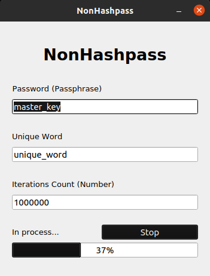

# uiNonHashpass

It's a UI Version of [**NonHashpass**](https://github.com/NotStatilko/NonHashpass).

You can make executable by yourself by running **this commands**:
```
# You may need to install python3 to perform this actions
git clone https://github.com/NotStatilko/uiNonHashpass
cd uiNonHashpass; pip3 install pyqt5
pyinstaller NonHashpass.py --onefile --noconsole
```
Executable will be in `dist` folder.

#### **WARNING**: All exit-keys will be 32byte (64hex) length. 
To expand, you can use original NonHashpass module.


